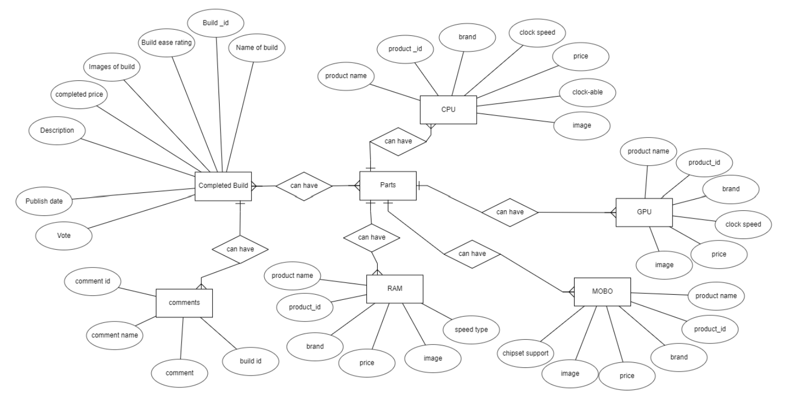

# Express RESTful API for PC-Together

This RESTful API is built with Express.js. and MongoDB for the PC-Together App. The front-end react project can be found [here](https://github.com/MarcusCWD/PC-together-front).

## Context

This is a custom API built for the [PC-Together](https://ephemeral-sunshine-555075.netlify.app/) App. The project is a simple CRUD application for managing computer builds posted by the community. The application is built with [MongoDB](https://www.mongodb.com/) and [Express.js](https://expressjs.com/).

## Database document design

 

# Endpoints

End Point Type | End Point Name | Purpose
------------ | ------------- | -------------
Get | /build | Obtain basic infomation on all builds
Get | /filter | Obtain basic infomation on filtered builds
Get | /:id/individualbuild | Obtain infomation on particular build
Post | /:id/comment | Create infomation on particular build's comments
Patch | /:id/voteup | Update infomation on particular build's votes
Get | /:id/:email/email | Check if submitted email is the same on server side
Put | /:id/edit | Update a particular build
Delete | /:id/delete | Delete a particular build
Get | /newbuild | Obtain all parts CPU, GPU, MOTHERBOARD, RAM
Post | /newbuild | Create a new build

# Technologies Used

- [Express.js](https://expressjs.com/)

  This API uses Express .js, a fast, unopinionated, minimalist web framework for Node.js

- [MondoDB](https://www.mongodb.com/)

  This API uses MongoDB, a document-oriented database.

# Deployment

- [Heroku](https://dashboard.heroku.com/)

  This API is deployed using Heroku.

# Acknowledgements

Stackoverflow community for countless free tutorials and help on RESTful API development, validation and documentation.